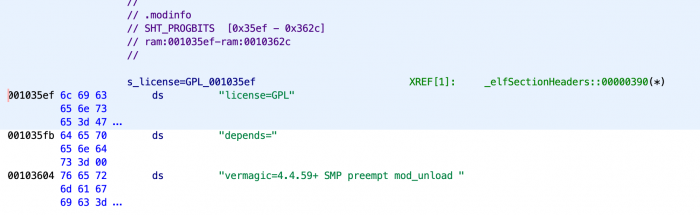

# Jun's Loader

## Key takeaways
 - A guy named Jun published a successful loader for DSM 6.1 on [Xpenology Community](https://xpenology.com/forum/topic/6253-dsm-61x-loader/?tab=comments#comment-54156)
 - The loader worked great until [DSM 6.2.4 came along](https://xpenology.com/forum/topic/41315-dsm-624-25554/)
 - The developer most likely left the scene; there aren't many details regarding the inner workings of the loader
 - This directory contains what's known about the loader
 - The full loader image contains Synology's proprietary binaries and thus **is NOT and will NOT** be included in this
   repo

---

## Image structure

```
+---+Loader Image+--------------------------------------------------------------------------+
| +-+Partition #0+------------------------------------------------------------------------+ |
| |                                                                                       | |
| |  +------+      +-+Early+Kernel+>bzImage<-----------+                                  | |
| |  | GRUB |      |                                   |                                  | |
| |  +------+      | +--------+  +--<kexec>----------+ |                                  | |
| |  +---------+   | | Kernel |  | +---------------+ | |                                  | |
| |  |grub.cfg |   | |  code  |  | |kexec||patcher?| | |                                  | |
| |  +---------+   | +--------+  | +---------------+ | |                                  | |
| |                |             +-------------------+ |                                  | |
| |                |                                   |                                  | |
| |                +-----------------------------------+                                  | |
| |                                                                                       | |
| +---------------------------------------------------------------------------------------+ |
|                                                                                           |
| +-+Partition #1+------------------------------------------------------------------------+ |
| |                                                                                       | |
| | +---------------------+  +-------+  +--<extra.lzma>--------------------------+        | |
| | | DSM Kernel <zImage> |  | rd.gz |  |                                        |        | |
| | +---------------------+  +-------+  | +--<modprobe>---------+ +-----------+  |        | |
| |                                     | | +----------+ +---+  | |addtl. *.ko|  |        | |
| |                                     | | |trampoline| |lkm|  | +-----------+  |        | |
| |                                     | | +----------+ +---+  |                |        | |
| |                                     | +---------------------+                |        | |
| |                                     +----------------------------------------+        | |
| |                                                                                       | |
| +---------------------------------------------------------------------------------------+ |
+-------------------------------------------------------------------------------------------+
```

The image contains two interesting partitions (+ 3rd BIOS boot):
  - Partition 0 contains the loader & configuration
     - GRUB: a standard EFI installation, nothing special there it seems
     - `grub.cfg`:
        - Contains standard grub config for booting Linux
        - Sets custom loader options (see dedicated section below)
        - Sets DSM-specific params
        - Doesn't have any mentions of "vender" (yes, it's the original spelling) support like Synology's loaders do
     - Early Kernel
       - Contains compressed kernel (not analyzed which one, some minimal one)
       - Internal ramdisk contains "kexec"
         - "kexec" file contains the usual Linux [`kexec(8)`](https://linux.die.net/man/8/kexec) which was modified
         - The kexec will, as expected, load the DSM Kernel from Partition 1
         - DSM Kernel is modified before it's launched (binary patching most likely?)

  - Partition 1 contains:
    - DSM kernel: looks like a standard DSM kernel
    - `rd.gz`: DSM kernel initramfs
    - `extra.lzma`
      - some re-compiled drivers also present in DSM
      - optional addon drivers (community-compiled)
      - "modprobe" which is not really what it says - it is a loader combined with a kernel module. The loader reads
        itself as a file, extracts kernel module, and loads it into DSM kernel (and this module does most of the
        loader's work). 


## General boot flow
  1. The image is initially burned onto a USB drive and booted, at which point GRUB starts
  2. GRUB boots "Early Kernel"
  3. Early Kernel init starts "kexec"
  4. Custom "kexec" binary loads DSM kernel, patches some things in it (e.g. ramdisk checksum protection)
  5. DSMs `rd.gz` is loaded and patched
     1. `jun.patch` (see this folder) is applied which allows for `extra.lzma` loading etc.
     2. Most likely the "modprobe" is injected into the ramdisk
     3. Possibly other things are done to it but this wasn't explored
  6. DSM kernel is booted
  7. Jun's lkm (Linux Kernel Module) is loaded which performs most of the shimming/patching/walking around quirks


## Versions
There are few unique versions of the loader supporting different hardware:
  - v1.03b for DS3615xs
  - v1.03b for DS3617xs (not sure if this is the same loader as for DS3615xs, didn't check that)
  - v1.04b for DS918+

Most of the analysis was done on DS918+ loader on the presumption it's the newest version, and most likely evolved from
previous loaders. The author didn't leave any sources for the module (nor any documentation besides [their posts 
on Xpenology Community](https://xpenology.com/forum/profile/23252-jun/content/)). Some build scripts were left in a 
[`kref/scripts` GitHub repository](https://github.com/RedPill-TTG/kref-scripts).

As a side note the DS918+ loader contains support for more than a single device:
  - DS916+
    - `deviceIndexInMetadata = 0`
    - matadata package starts at `00103850`
    - PCI devices list starts at "PTR_DS916+_PCI_DEVICES_LIST" / `00103ae0`
  - DS3615xs
    - `deviceIndexInMetadata = 1`
  - DS3617xs
    - `deviceIndexInMetadata = 2`
    - metadata at `00103890`
    - devs list at "PTR_DS3617xs_PCI_DEVICES_LIST" / `00103a00`
  - DS918+
    - `deviceIndexInMetadata = 3` 
    - metadata at `001038b0`
    - devs list at "PTR_DS3617xs_PCI_DEVICES_LIST" / `00103a00`
  - DS3018xs
    - `deviceIndexInMetadata = 4`
    - metadata at `001038d0`
    - no devs list specified (unfinished? not needed?)

There's also, what seems to be, a list referred to as "i915" which is probably list of all generic devices present in 
all the models above. It's located at "PTR_i915_PCI_DEVICES" / `00103a80`

## Configuration
Configuration of the system is done via kernel parameters. Some of them are loader-specific and some are built-in into
DSM. However, the following options are recognized by Jun's loader:

```
        ; extracted from jun.ko (DS918p-v1.04b)
        
                             PTR_s_kernCMD_vid_00102a48                      XREF[1]:     init_module:0010251f(R)  
        00102a48 7a 2f 10        addr       s_kernCMD_pid                                    = "pid="
                 00 00 00 
                 00 00
        00102a50 75 2f 10        addr       s_kernCMD_vid                                    = "vid="
                 00 00 00 
                 00 00
        00102a58 6a 30 10        addr       s_kernCMD_loglevel                               = "loglevel="
                 00 00 00 
                 00 00
        00102a60 74 30 10        addr       s_kernCMD_elevator                               = "elevator="
                 00 00 00 
                 00 00
        00102a68 9c 2f 10        addr       s_kernCMD_sata_uid                               = "sata_uid="
                 00 00 00 
                 00 00
        00102a70 a6 2f 10        addr       s_kernCMD_sata_pcislot                           = "sata_pcislot="
                 00 00 00 
                 00 00
        00102a78 b4 2f 10        addr       s_kernCMD_mfg                                    = "mfg"
                 00 00 00 
                 00 00
        00102a80 b8 2f 10        addr       s_alarm_day=_00102fb8                            = "alarm_day="
                 00 00 00 
                 00 00
        00102a88 c3 2f 10        addr       s_alarm_weekdays=_00102fc3                       = "alarm_weekdays="
                 00 00 00 
                 00 00
        00102a90 d3 2f 10        addr       s_kernCMD_SasIdxMap                              = "SasIdxMap="
                 00 00 00 
                 00 00
        00102a98 de 2f 10        addr       s_kernCMD_syno_port_thaw                         = "syno_port_thaw="
                 00 00 00 
                 00 00
```

For the exact details regarding inner working of each of them see the [list of quirks](../quirks/README.md).


## What it does?
This section has just a bare list of things which are done. More detailed descriptions are described in [`quirks` 
directory of this repo](../quirks): 
  - [x] Patch kernel to go around ramdisk checksum check
  - [ ] Avoid detection (if not done [system will unmount all volumes and corrupt itself](https://xpenology.com/forum/topic/6253-dsm-61x-loader/?do=findComment&comment=54229))
    - [x] Remove kernel cmdline params which are for loader-use only (see "Configuration" section)
    - [x] Use random kernel module name
    - [ ] *more to come here*
  - [x] Shim boot device to be detected as a proper "synoboot"
    - This is done using a kernel module AS WELL as in userspace using `mknod` (see [`jun.path`](jun.patch))
    - The `mknod` method seems to be redundant, problematic, and actually failing for some time (with no downsides observer)
  - [x] Emulate expected PCI(E) devices depending on the model
  - [x] Emulate RTC
  - [ ] Fake communication w/uC on a DS motherboard (control leds, fans etc;  
    [see Jun's post](https://xpenology.com/forum/topic/6253-dsm-61x-loader/?do=findComment&comment=54229))
  - [x] Swap serial ports (some models only)
  - [ ] Prevent `.so` corruption ([see Jun's post](https://xpenology.com/forum/topic/6253-dsm-61x-loader/?do=findComment&comment=64569))
  - [ ] *more to come here*
  
Items marked with a checkbox are already explored and understood. These without are not.  
All information gathered here a result of observation of booted systems as well as painstakingly reverse engineering 
Jun's LKM. The module, which does bulk of the work, is licensed under GPL according to the binary:



This can be independently verified by doing `strings FILE | grep license` on `modprobe` or `jun.ko` from binaries.

## Why the loader no longer works?
First of all: Jun's loader is rather secretive. We will leave interpretation to the reader but we think some/all of the
following things were done to obfuscate what/how it does stuff:
  - DSM kernel loading is done using a modified kexec. The kexec code is a pretty big and complex thing so adding some
    small-ish code there can be rather hard to trace in decompiled source (vs. the real kexec code)
  - LKM has a random name after it's loaded
  - LKM is hidded within `modprobe` binary
  - Almost all error messages are cryptic 2-3 letter codes (e.g. `gc: ret=-1`) which have no meaning to people other 
    than Jun

Attempting to boot DSM >6.2.3 with Jun's loader results in:
```
va not found
Failed to process header
```

This message is present in the modified `kexec` source. The code implements custom(?) ELF parsing routines which read 
the compressed kernel image to find offsets to patch. DSM 6.2.4 didn't change the kernel itself, but the packing did
somewhat change. This doesn't seem to be deliberate but perhaps shows that Synology updated their build processes, as 
the same problem exists when booting v7 beta using Jun's loader.

```
# binwalk vmlinux-* | grep 'Linux k'
8388800       0x8000C0        Linux kernel version 3.10.1
8388800       0x8000C0        Linux kernel version 3.10.1

Scan Time:     2021-05-30 13:01:52
Target File:   /mnt/_synoboot-old/zImage
MD5 Checksum:  e3d859f75819dda05e065c5da23187f2
Signatures:    386

DECIMAL       HEXADECIMAL     DESCRIPTION
--------------------------------------------------------------------------------
15966         0x3E5E          LZMA compressed data, properties: 0x5D, dictionary size: 67108864 bytes, uncompressed size: -1 bytes
3045174       0x2E7736        LZMA compressed data, properties: 0xCF, dictionary size: 0 bytes, uncompressed size: 2156462080 bytes


Scan Time:     2021-05-30 13:01:52
Target File:   /mnt/_synoboot-new/zImage
MD5 Checksum:  d6e6929c303ff7e60834ea4b60564fd7
Signatures:    386

DECIMAL       HEXADECIMAL     DESCRIPTION
--------------------------------------------------------------------------------
15966         0x3E5E          LZMA compressed data, properties: 0x5D, dictionary size: 67108864 bytes, uncompressed size: -1 bytes
```


After analysis, we found out that `va not found` message is actually an error referencing inability to extract the 
standard `p_vaddr` from the ELF binary. Most likely it's because that method is very fuzzy in nature.
