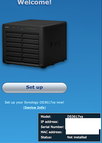

# Franken DSM

As running the whole VDSM distribution is not really feasible (i.e. possible, but we're not willing to go around license 
checks) as described in [vdsm-investigation](vdsm-investigation.md) I decided to try another route: pairing a DS 
(e.g. 3615xs) OS with VDSM kernel.

**TL;DR:** It can be done but requires a loader too (patching Synobios checks etc)


## But... why?
Initial motivation factors:
 1. *maybe* not deal with the kernel-level checks
 2. Have a much newer kernel (v4.4 vs v3.10) which is compiled to run on older CPUs (unlike DS918+ kernel)

As IG-88 pointed out on Xpenology Community this kernel has other advantages too. It supports up to 128 cores (while DS 
kernels are limited) and actually supports all usual SCSI peripherals.

## Notable changes - VDSM vs DS kernels

### Features only in DS
  - HA (can be fixed, but does anyone use that with xpenology?)
  - Disk compatibility database (this is most likely easily fixable with manual DB update from settings)

### Drivers support
  - **Drivers only in DS**
    - igb (various Intel Gigabit ethernets)
    - ip_tunnel
    - ixgbe (Intel 82598/82599 10Gb ethernets)
    - leds-lp3943
    - **mpt2sas (LSI HBA)**
    - **mpt3sas (LSI HBA)**
    - mv14xx (Marvell 1475 HBA)
    - phy_alloc_0810_x64 (?)
    - synotty (Synology's custom serial driver)
    - **e1000e**

  - **Drivers only in VDSM**
    - virtio (everything for running under KVM properly)
    - EHCI (native USB 2.0)
    - i40evf (Intel XL710 10/40Gb ethernets)
    - igbvf (Intel eth. passed via SR-IOV)
    - ixgbevf (helper for igbvf)
    - be2net (some emulated ethernet, never saw that before)

  
All in all drivers support is better. I deliberately omitted some modules which weren't cross-present since they
changed names between old vs. new kernel. The functionality is still there thou. I **bolded** these which will may be 
problematic. The biggest ones are probably these supporting LSI and Intel GbE, but those can most likely be compiled 
using a standard v4.4 tree.


## Initial patching efforts
  - The goal is to have a split-brain situation where as much of the stuff thinks it's a DS while DRM-like features are 
    thinking it's a VDSM ;)
  - Some of the stuff checks the platform using the platform identifier (unique key in synoinfo) but some check the bios 
  - After initial patching I've got:  
    
  - I was able to get through disk formatting up to the moment where the installation actually takes place. The 
    installation stalled with error 13. Here are the steps to debug such thing if anybody struggles during development:
    - I started comparing installation from Jun's DS3617xs running under VM vs. vanilla VDSM kernel + 3617 PAT 
    - The installer running under VDSM image is MUCH more verbose (e.g. it prints details about every file's code 
      signature from `synocodesign`).  
      The only clue I was able to find is the following:
      ```
      # Jun's
      updater: updater.c:631 file [/tmp/bootmnt/VERSION] process done.
      updater: updater.c:641 checksum file updated by [/bin/cp -f /tmp/checksum.syno.tmp /tmp/bootmnt/checksum.syno]
      updater: updater.c:825 GRUB version file /tmp/bootmnt/GRUB_VER does not exist
      updater: updater.c:7221 ==== Finish flash update ====
      
      # VDSM-3617
      updater: updater.c:631 file [/tmp/bootmnt/VERSION] process done.
      updater: updater.c:641 checksum file updated by [/bin/cp -f /tmp/checksum.syno.tmp /tmp/bootmnt/checksum.syno]
      updater: updater.c:1655 Bios upgrade needed file not exist, skip BIOS updating
      updater: updater.c:7082 fail to upgrade BIOS
      updater: updater.c:727 Restoring [zImage]
      updater: updater.c:738 Copying file [/tmpData/synob@ckup/zImage] as [/tmp/bootmnt/zImage], result[0]
      updater: updater.c:727 Restoring [rd.gz]
      <and here it continues restoring files>
      ```
    - The failure seems to be related to the BIOS update:
      - The error message is... bogus according to what `updater` is actually doing
      - The `phy_alloc_0810_x64` is one of the components of the flasher (not present in VDSM image)
      - The `updater` also verifies presence of `H2OFFT-Lx64` and `platform.ini` files
      - If any of the three is missing the *"Bios upgrade needed file not exist, skip BIOS updating"* is triggered
      - Attempting to make sure that the BIOS update is at least attempted causes KVM CPU emulation crash - don't do 
        that :D
        ```
        QEMU[1071]: KVM internal error. Suberror: 1
        QEMU[1071]: emulation failure
        ...
        QEMU[1071]: Code=kvm: /build/pve-qemu/pve-qemu-kvm-5.2.0/include/hw/core/cpu.h:660: cpu_asidx_from_attrs: Assertion `ret < cpu->num_ases && ret >= 0' failed.
        ```
      - Since there were more things to discover I did a simple hack to remove the bios file from the update after 
        signatures are checked but before bios check is performed - good enough for a PoC:
        ```
        rm /tmp/checksum.syno.tmp
        while [ ! -f /tmp/checksum.syno.tmp ]; do true; done; rm '/tmpData/upd@te/bios.ROM'
        ```
      - After all these above I've got ***"Congratulations!! The update has been completed!! Do configupdate when next 
        bootup."*** 
  - ... but the happiness after installation was short-lived as it welcomed me with an error I've never seen before:  
    
    - Looking at the logs the update was applied correctly but something weird *(spoiler: a ramdisk checksum, continue 
      reading)* happens afterwards:
      ```
      linuxrc.syno executed successfully.
      Post init
      [   15.502431] EXT4-fs (md0): mounted filesystem with ordered data mode. Opts: barrier=1
      switch_root: error moving root
      START /linuxrc.syno
      mkdir: can't create directory '/tmpRoot': File exists
      ``` 
    - Debugging further I found innocently looking error which starts the cascade of doom:
      ```
      [   11.922345] VFS: opened file in mnt_point: (/dev), file: (/console)
      umount: can't umount /dev: Device or resource busy
      ```
      In essence to move root successfully stuff like `/dev` has to be moved. If anything fails before the `switch_root` 
      will fail to execute the `mount()` syscall with [a very cryptic error](https://github.com/brgl/busybox/blob/abbf17abccbf832365d9acf1c280369ba7d5f8b2/util-linux/switch_root.c#L134). 
      That aside, notes in the `switch_root` linked here are worth reading too.
    - Famous last words: ~~this should be an easy fix...~~ ***(spoiler: oh hell no, it wasn't, see next section)*** and 
      in fact Jun's patch had some provisioning for that (now it makes sense why he nuked console everywhere... quantum 
      linux: it breaks when you're looking at it :D). ***(Note from later: this IS true, but the core of the problem is 
      somewhere else, this console thing is for another bug: a device w/o serial ports)***
    - ...it turned out to not be so easy: after debugging for over a night I found that any attempts to remount rootfs
      from initramfs (which is the last step of the ramdisk/first step of actual OS boot) fail for no obvious reason. 
      I think I tried everything and found that for some reason MS_MOVE doesn't want to work
    - ***Later discovery: MS_MOVE doesn't work because of the ramdisk check.***  
      See more on that in [quirks/ramdisk-checksum.md](../quirks/ramdisk-checksum.md). This "feature" is specific to 
      DSM's kernel.
    - I ~~documented~~ brain-dumped the steps to get to this point if anyone wants to play. See [`steps-to-franken-dsm.txt`](steps-to-franken-dsm.txt]).
