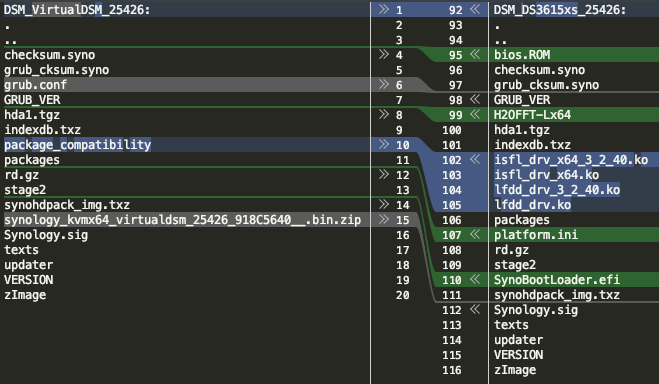
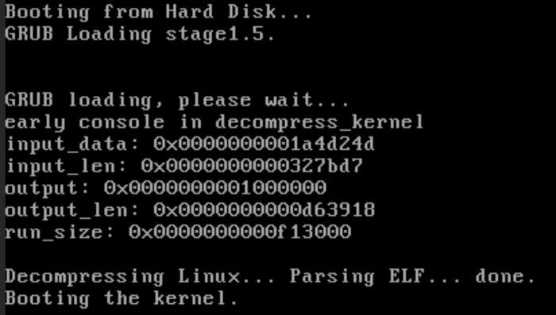

# VDSM Investigation

This document describes a pathway of getting sense of how VDSM works and attempting to use it outside the VMM.

**TL;DR:** It's possible to use VDSM images outside of Synology's VMM but it requires license checks to be defeated. As 
I don't condone piracy this route wasn't pursued further.


## PATs differences
When a VMM is used with VDSM a special PAT is used (using "VirtualDSM" platform instead e.g. DS3615xs). After unpacking
there are a couple differences comparing with a regular (here: DS3615xs) PAT:



Ignoring what's not included in the VDSM b/c it's not a physical system, the notable changes here are I think:
- Presence of `grub.conf`
- Presence of `synology_kvmx64_virtualdsm_25426_918C5640__.bin.zip` (~20MB)

The zip file contains a disk image which looks like a boot drive for the VDSM:
  ```
  # fdisk -l ./synology_kvmx64_virtualdsm_25426_918C5640__.bin
  Disk ./synology_kvmx64_virtualdsm_25426_918C5640__.bin: 110 MiB, 115343360 bytes, 225280 sectors
  Units: sectors of 1 * 512 = 512 bytes
  Sector size (logical/physical): 512 bytes / 512 bytes
  I/O size (minimum/optimal): 512 bytes / 512 bytes
  Disklabel type: dos
  Disk identifier: 0x28abac75
  
  Device                                             Boot Start    End Sectors  Size Id Type
  ./synology_kvmx64_virtualdsm_25426_918C5640__.bin1 *       63  32129   32067 15.7M 83 Linux
  ./synology_kvmx64_virtualdsm_25426_918C5640__.bin2      32130 224909  192780 94.1M 83 Linux
  ```

Both partitions contain a... familiar structure... weirdly familiar to Jun's loader:
  ```
  ../part1
  ├── boot
  │   └── grub
  │       ├── e2fs_stage1_5
  │       ├── grub.conf
  │       ├── menu.lst -> grub.conf
  │       ├── stage1
  │       └── stage2
  ├── GRUB_VER
  ├── rd.gz
  └── zImage
  
  
  ../part2
  ├── grub_cksum.syno
  ├── rd.gz
  ├── vender
  └── zImage
  ```

## Bootloader
The `synology_kvmx64_virtualdsm_25426_918C5640__.bin` file contains a bootdisk image for VMM.
- both `part1/zImage` & `part2/zImage` (kernel) and `part1/rd.gz` & `part2/rd.gz` (initrd) are identical respectively
- both `part1/boot/grub/grub.conf` and `PAT/grub.conf` are identical
- `zImage` contains a pretty new kernel (in comparison to usual DS kernels):
  ```
  Linux kernel x86 boot executable bzImage, version 4.4.59+ (root@build1) #25426 SMP PREEMPT Tue May 12 04:41:18 CST 2020, RO-rootFS, swap_dev 0x3, Normal VGA
  ```
- `stage1/1_5` files are bare standard GRUB files
- `stage2` is a modified GRUB with support for vender & files signing *(side note: GPL again... no sources)*


## VMM analysis
After static analysis of the image I went into the active VM analysis. As the VMM uses KVM (via QEmu) backend I first
started a normal Linux machine and then started VDSM:

1. The VM uses VirtIO drivers for everything, so the VDSM has drivers specifically for
   [libvirt like community made for Jun's loader](https://xpenology.com/forum/topic/13887-dsm-6x-proxmox-backup-template/?do=findComment&comment=174590)
2. The runtime of the machine is nothing special:
    1. Config like for any Linux VM
    2. Disks mounted via iSCSI LUN
    3. PAT **is not** mounted to the VM at any moment - host DSM mounts everything using iSCSI LUN
3. The kernel in VDSM is compiled for **both Intel and AMD**
4. Package contains a special synobios:
   ```
   [    2.746361] kvmx64_synobios: module license 'Synology Inc.' taints kernel.
   [    2.747399] Disabling lock debugging due to kernel taint
   [    2.748581] 2021-6-2 1:9:54 UTC
   [    2.749193] synobios: load, major number 201
   [    2.749635] Brand: Synology
   [    2.751196] Model: VirtualDSM
   [    2.751497] set group disks wakeup number to 4, spinup time deno 7
   [    2.752661] synobios cpu_arch proc entry initialized
   [    2.753745] synobios crypto_hw proc entry initialized
   [    2.754295] synobios syno_platform proc entry initialized
   [    2.754831] synobios ioctl TCGETS /dev/ttyS1 failed
   [    2.755347] synobios unable to set termios of /dev/ttyS1
   [    2.761050] synobios: unload
   ```

   The bios kernel module (`kvmx64_synobios`) is much smaller than DS3615xs one:
   ```
   # file *.ko
   synobios-ds3615xs.ko: ELF 64-bit LSB relocatable, x86-64, version 1 (SYSV), BuildID[sha1]=b51232d7ad1bbb93bf868cafd962bb747cbf2ab8, not stripped
   synobios-vdsm.ko:     ELF 64-bit LSB relocatable, x86-64, version 1 (SYSV), BuildID[sha1]=b7baabd787acec8716fac8d85901cf984555b974, not stripped
   
   # ls -sh *.ko
   120K synobios-ds3615xs.ko
   80K synobios-vdsm.ko
   ```

5. When VM is exported as OVA three different disks are exported:
  - 10G thin provisioned disk with just the contents of `synology_kvmx64_virtualdsm_25426_918C5640__.bin`
  - 10G thin provisioned disk with just the contents the OS installed (standard ~2GB two partition arrangement OS+SWAP)
  - 10G thin provisioned disk w/o partition (empty disk assigned to the VM to be used for data storage)


## Can VMM image be used in a different HV?

### General analysis
Well, that was the next logical step. I used something close to VMM - Proxmox. Suspecting that iSCSI part is not
important I simply attached Synology's bootloader (`synology_kvmx64_virtualdsm_25426_918C5640__.bin`) via loop driver 
using SCSI-VirtIO driver & SATA (as the SCSI itself will not boot using SeaBIOS).

The VGA output successfully shows kernel decompression:  



Since I was booting without the pre-prepared disk from VM I've got to the crashed state. The standard
root/[daily password](../tools/syno-pwd.php) works like a charm. Since that build ~~~most likely uses vid/pid check for specific iSCSI device~~
(correction: it uses PCI locations) from VMM (I didn't bother emulating that at this time) root is normally present in
`/dev/synoboot`. This gave me the obvious *"Exit on error [3] init not health...."* while booting on Proxmox. I took a
peek at the original [Jun's patch](../Jun%20loader/jun.patch) for the init scripts and modified it a bit:

  - It fails with new version -> I moved the function to a more robust place
  - It originally calls `FixSynoboot()` on `Exit()` when the health check fails -> while it probably works it may be
    fragile as some steps of the boot process may be skipped
  - I added more info to make debugging easier
  - However, while this patch may be a viable option it will break other things (sdb will have to be renamed to sda
    etc) - I moved further as the kernel "sources" (or what's left from them) are available
  - I ended up not using `FixSynoboot()` to keep stuff vanilla

### Quirks
While digging I found that the ramdisk has some quirks for running under a HV:

- There are three different HV-related modes: `kvmx64` (VMM), `nextkvmx64`, and `kvmcloud` (?!). The second one uses
  `/dev/synoboot3` (normally there are only 2) as a root device. I didn't dig deeper into what `nextkvmx64` actually
  is ¯\_(ツ)_/¯
- The support for VirtIO is intentional and is not custom:
  ```
   319 if [ "$UniqueRD" = "kvmx64" -o \
   320                 "$UniqueRD" = "nextkvmx64" -o \
   321                 "$UniqueRD" = "kvmcloud" ]; then
   322         insmod /lib/modules/virtio.ko
   323         insmod /lib/modules/virtio_ring.ko
   324         insmod /lib/modules/virtio_pci.ko
   325         insmod /lib/modules/virtio_blk.ko
   326         insmod /lib/modules/virtio_net.ko
   327         insmod /lib/modules/virtio_scsi.ko
   328         insmod /lib/modules/virtio_console.ko
   329 fi
  ```

### Conclusion
Running under non-VMM should be possible. Additionally, things like disabled RAID and such aren't a problem. They can be
enabled back (kernel has all the modules needed).


## Attempting to run VMM image under Proxmox
Next I started working on running VDSM on a standard KVM (as oppose to VMM) in Proxmox:

- Normally when VDSM is run under VMM it hand-picks PCI slots which is... unusual (normally you let your HV do that):
    ```
    # UUIDs are stripped for readability & replaced w/*UUID#*
    
     -device vhost-scsi-pci,virtqueue_size=256,cmd_per_lun=250,wwpn=naa.*UUID1*,addr=0xa,id=vdisk_*UUID1*,set_driverok=off,num_queues=1,max_sectors=16384,boot_tpgt=1,bootindex=1
     -device vhost-scsi-pci,virtqueue_size=256,cmd_per_lun=250,wwpn=naa.*UUID2*,addr=0xb,id=vdisk_*UUID2*,set_driverok=off,num_queues=1,max_sectors=16384,boot_tpgt=1,bootindex=2
     -device vhost-scsi-pci,virtqueue_size=256,cmd_per_lun=250,wwpn=naa.*UUID3*,addr=0xc,id=vdisk_*UUID3*,set_driverok=off,num_queues=1,max_sectors=16384,boot_tpgt=1,bootindex=3
    ```

- Kernel has a special provisioning for running VDSM. Normally DSM boot device/loader is a USB key or a SATA-DoM. 
  However, the KVM kernel contains additional checks for exactly these special PCI slots:
    ```c
    # synoconfigs/kvmx64
    CONFIG_SYNO_KVMX64_PCI_SLOT_SYSTEM=11
    CONFIG_SYNO_KVMX64_PCI_SLOT_BOOT=10
    
    # drivers/scsi/sd.c
            while (virtdev) {
                if (virtdev->driver && virtdev->driver->name && !strcmp(virtdev->driver->name, "virtio-pci")) {
                    pcidev = to_pci_dev(virtdev);
                    break;
                }
                virtdev = virtdev->parent;
            }
            if (pcidev && PCI_SLOT(pcidev->devfn) == CONFIG_SYNO_KVMX64_PCI_SLOT_BOOT) {
                return SYNO_DISK_SYNOBOOT;
            }
            
            
    # drivers/scsi/virtio_scsi.c
    # contains a hack to make sure system partition is always first
        if (pcidev && PCI_SLOT(pcidev->devfn) >= CONFIG_SYNO_KVMX64_PCI_SLOT_SYSTEM) {
            index = PCI_SLOT(pcidev->devfn) - CONFIG_SYNO_KVMX64_PCI_SLOT_SYSTEM;
        }
        return index;
    ```
    - **0xa** = 10 = `CONFIG_SYNO_KVMX64_PCI_SLOT_BOOT` => `/dev/synoboot`
    - **0xb** = 11 = `CONFIG_SYNO_KVMX64_PCI_SLOT_SYSTEM` => `/dev/sda`

- Using a standard Linux KVM on Proxmox the drives can be easily emulated, and it works with no modifications to the
  kernel or the ramdisk:
  ```
  [    3.411295] scsi host0: Virtio SCSI HBA
  [    3.419226] scsi 0:0:0:0: Direct-Access     QEMU     QEMU HARDDISK            2.5+ PQ: 0 ANSI: 5
  [    3.421672] sd 0:0:0:0: [synoboot] 225280 512-byte logical blocks: (115 MB/110 MiB)
  [    3.424059] sd 0:0:0:0: [synoboot] Write Protect is off
  [    3.426034] sd 0:0:0:0: [synoboot] Write cache: enabled, read cache: enabled, doesn't support DPO or FUA
  [    3.434378]  synoboot: synoboot1 synoboot2
  [    3.442227] sd 0:0:0:0: [synoboot] Attached SCSI disk
  [    3.532075] usb 1-1: new full-speed USB device number 2 using uhci_hcd
  [    5.437846] scsi host1: Virtio SCSI HBA
  [    5.446323] scsi 1:0:0:0: Direct-Access     QEMU     QEMU HARDDISK            2.5+ PQ: 0 ANSI: 5
  [    5.455375] sd 1:0:0:0: [sda] 16777216 512-byte logical blocks: (8.59 GB/8.00 GiB)
  ```

  It literally needs just the following QEmu params:
  ```
  -device virtio-scsi-pci,id=hw-synoboot,bus=pci.0,addr=0xa -drive file=<file>,if=none,id=drive-synoboot,format=raw,cache=none,aio=native,detect-zeroes=on -device scsi-hd,bus=hw-synoboot.0,channel=0,scsi-id=0,lun=0,drive=drive-synoboot,id=synoboot0,bootindex=1
  -device virtio-scsi-pci,id=hw-synosys,bus=pci.0,addr=0xb -drive file=<file>,if=none,id=drive-synosys,format=raw,cache=none,aio=native,detect-zeroes=on -device scsi-hd,bus=hw-synosys.0,channel=0,scsi-id=0,lun=0,drive=drive-synosys,id=synosys0,bootindex=2
  ```

- After attempted install on non-VMM the (expected) lack of communication between guest & host stops the process:
  ```
  install.cgi: guest_command.c:86 Failed to retrieve message from host [timeout]
  install.cgi: vdsm_get_update_deadline.c:41 Failed to get vdsm update deadline.
  install.cgi: The vdsm is newer than license expire time.
  install.cgi: ninstaller.c:2730(ErrFHOSTDoUpgrade) err=[-1]
  install.cgi: ninstaller.c:2746(ErrFHOSTDoUpgrade) retv=[-65]
  install.cgi: install.c:988 Upgrade for Installation by the download patch fail.
  install.cgi: install.c:1290 Upgrade by the uploaded patch fail.
  install.cgi: ninstaller.c:253 umount partition /tmpData
  synoagentregisterd: guest_command.c:86 Failed to retrieve message from host [timeout]
  synoagentregisterd: vdsm_serial.c:84 Failed to get vdsm sn
  synoagentregisterd: vdsm_serial.c:128 Failed to get vdsm sn
  <last 3 messages repeated forever>
  ```
- The guest<>host communication was previously handled by `/usr/syno/sbin/synoagentregisterd`. Now that binary is
  symlinked to `/usr/syno/bin/synosearchagent`. The library responsible for handling S/N transfer between guest and
  host is most likely `/usr/lib/libsynovdsmcore.so` (it's the only file with "vdsm_serial" string present).
- There's overall very little regarding VDSM in the image (see `hda1.tgz` file in PAT):
  ```
  ./usr/share/init/vdsm_dummy_tty.conf
  ./usr/lib/libsynovdsmcore.so
  ./usr/lib/libsynovdsm.so
  ./usr/syno/synovdsm
  ./usr/syno/synovdsm/scripts
  ./usr/syno/synovdsm/scripts/initializeVdsm.sh
  ./usr/syno/synovdsm/conf
  ./usr/syno/synovdsm/conf/vdsm_service_soft_limit.conf
  ./usr/syno/synovdsm/conf/cdsm_profile.conf
  ./usr/syno/synovdsm/conf/cdsm_service_soft_limit.conf
  ./usr/syno/synovdsm/conf/vdsm_profile.conf
  ./usr/syno/synovdsm/conf/vdsm_service_strict_limit.conf
  ./usr/syno/synovdsm/conf/cdsm_service_strict_limit.conf
  ./usr/syno/bin/synovdsmtool
  ./etc.defaults/apparmor.d/abstractions/libsynovdsmcore
  ```

  There's also `/usr/lib/libsynovmcommguest.so.6.2` for generic host<>guest communication using
  `/usr/syno/bin/synoguestcommd` binary. The serial communication is done via `/dev/vport1p1` (standard virtio port,
  see `drivers/char/virtio_console.c` in Linux kernel).
- While I poked around the communication (it's binary, so to get anything useful decompilation of the comm library is
  needed) **I would rather not go around license checks** - this is a tricky ground. **Synology sells them, and I'm
  here for a good'ol hacking puzzle, not for piracy**.
- Alternatively (which ~~I didn't explore yet~~ -> see [franken-dsm document](franken-dsm.md)) we can try running VDSM 
  kernel with normal DSM distribution. This should work actually ;) While it may sound crazy at first, this is 
  essentially how docker runs the world.
