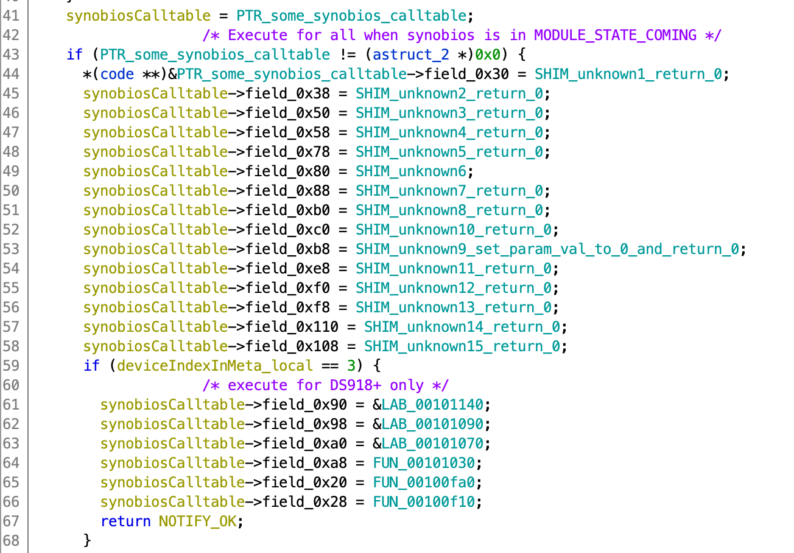

# Hardware manufacturer's BIOS (mfgBIOS)

Synology uses their software on a variety of hardware where features only slightly different. However,the hardware 
ranges from simple low power ARM boxes to rack-mounted beasts. This means there has to be some bridge between the low
level stuff and high-level things like the web panel.


### What this does to the system?
Due to the closed-source nature of the module everything is a suspicion. However, lack of many of the interfaces will 
surely make the latter layers (i.e. the whole DSM) unhappy. Immediatelly after the module loads kernel log is being 
filled with:

```
[  154.736374] parameter error. gpiobase=00000000, pin=4, pValue=ffff88000e1d79c4
[  154.736688] parameter error. gpiobase=00000000, pin=4, pValue=ffff88000e1d79c4
[  156.738788] parameter error. gpiobase=00000000, pin=4, pValue=ffff88000e1d79c4
```

Keep in mind this structure above is NOT the same between software versions. The two major changes are:
  - Addition of different `set_disk_led` signature (but it's `ifdef`ed)
  - `set_ok_to_remove_led` and `get_sys_current` were shifted below `hwmon_` (without any `idef`s, sic!)

#### Appendix B: HWMON sensors
Different platforms support different [hwmon](hwmon.md) sensors. Below are these which we briefly tested.

### Implementation
Looking through GPLed source code of Linux kernel for DS3615xs we can find many code paths which aren't called directly
but are exported from the kernel. Moreover, these code paths deal with specific hardware features (e.g.
`syno_mv_9235_disk_led_set` and `syno_mv_9235_disk_led_get` in `drivers/ata/ahci.c`). Looking through what actually
consumes these symbols we can see that the `synobios` module seems to be the one:

```
$ readelf -a /usr/lib/modules/synobios.ko | grep 'syno_mv_9235_disk_led_'
0000000051ea  00bd00000002 R_X86_64_PC32     0000000000000000 syno_mv_9235_disk_led_ - 4
0000000051f4  00e300000002 R_X86_64_PC32     0000000000000000 syno_mv_9235_disk_led_ - 4
0000000059ef  00bd00000002 R_X86_64_PC32     0000000000000000 syno_mv_9235_disk_led_ - 4
0000000059f9  00e300000002 R_X86_64_PC32     0000000000000000 syno_mv_9235_disk_led_ - 4
   189: 0000000000000000     0 NOTYPE  GLOBAL DEFAULT  UND syno_mv_9235_disk_led_set
   227: 0000000000000000     0 NOTYPE  GLOBAL DEFAULT  UND syno_mv_9235_disk_led_get
```

This makes perfect sense - synobios presumably provides an abstraction of these allowing for a safe access from
non-privileged code (i.e. code not running in the kernel). This can be inferred by the presence of `/dev/synobios` and
`/proc/synobios/`. As dissembling non-GPL binaries is tricky legally we stayed within roams of what the module tells us
by itself. Looking at the symbols itself we can see supported platforms (or at least we know it supports these "at
minimum"):

```
$ cat /proc/kallsyms | grep DS
ffffffffa01dd310 t DS3612xsInitModuleType	[bromolow_synobios]
ffffffffa01dd340 t DS3615xsInitModuleType	[bromolow_synobios]
ffffffffa01dd410 t DS3611xsInitModuleType	[bromolow_synobios]
ffffffffa01dd570 t DS2414xsInitModuleType	[bromolow_synobios]
```

Additionally, many parts of the system use `ioctl` to communicate with the `/dev/synobios` device to perform various
actions. See 

### How does it play with loaders?
Based on the analysis of Jun's module and symbols provided by the bios module itself we can find a table in memory. The
table contains a list of multiple pointers. As the module exports all symbols necessary, there's no need for disassembly 
of the proprietary code to understand which parts needs to be provided to make the code happy:

```
40 80 1e a0 ff ff ff ff  [00] 0x000 	ffffffffa01e8040	synobios_model_cleanup+0x7e40/0x8 [bromolow_synobios]
a0 ed 1d a0 ff ff ff ff  [01] 0x008 	ffffffffa01deda0	GetBrand+0x0/0x10 [bromolow_synobios]
50 f7 1d a0 ff ff ff ff  [02] 0x010 	ffffffffa01df750	GetModel+0x0/0x250 [bromolow_synobios]
00 00 00 00 00 00 00 00  [03] 0x018 	          (null)	          (null)
c0 e7 1d a0 ff ff ff ff  [04] 0x020 	ffffffffa01de7c0	rtc_bandon_get_time+0x0/0x1a0 [bromolow_synobios]
20 ea 1d a0 ff ff ff ff  [05] 0x028 	ffffffffa01dea20	rtc_bandon_set_time+0x0/0x350 [bromolow_synobios]
00 00 00 00 00 00 00 00  [06] 0x030 	          (null)	          (null)
90 f5 1d a0 ff ff ff ff  [07] 0x038 	ffffffffa01df590	SetFanStatus+0x0/0xe0 [bromolow_synobios]
70 f6 1d a0 ff ff ff ff  [08] 0x040 	ffffffffa01df670	GetSysTemperature+0x0/0x20 [bromolow_synobios]
50 f2 1d a0 ff ff ff ff  [09] 0x048 	ffffffffa01df250	GetCpuTemperatureDenlowI3Transfer+0x0/0x80 [bromolow_synobios]
90 fb 1d a0 ff ff ff ff  [10] 0x050 	ffffffffa01dfb90	SetDiskLedStatusBy9235GPIOandAHCISGPIO+0x0/0x60 [bromolow_synobios]
00 00 00 00 00 00 00 00  [11] 0x058 	          (null)	          (null)
00 00 00 00 00 00 00 00  [12] 0x060 	          (null)	          (null)
00 00 00 00 00 00 00 00  [13] 0x068 	          (null)	          (null)
00 00 00 00 00 00 00 00  [14] 0x070 	          (null)	          (null)
70 ee 1d a0 ff ff ff ff  [15] 0x078 	ffffffffa01dee70	SetGpioPin+0x0/0x50 [bromolow_synobios]
f0 ee 1d a0 ff ff ff ff  [16] 0x080 	ffffffffa01deef0	GetGpioPin+0x0/0x50 [bromolow_synobios]
00 00 00 00 00 00 00 00  [17] 0x088 	          (null)	          (null)
60 e9 1d a0 ff ff ff ff  [18] 0x090 	ffffffffa01de960	rtc_bandon_set_auto_poweron+0x0/0xc0 [bromolow_synobios]
10 e5 1d a0 ff ff ff ff  [19] 0x098 	ffffffffa01de510	rtc_get_auto_poweron+0x0/0x50 [bromolow_synobios]
00 00 00 00 00 00 00 00  [20] 0x0a0 	          (null)	          (null)
00 00 00 00 00 00 00 00  [21] 0x0a8 	          (null)	          (null)
70 f5 1d a0 ff ff ff ff  [22] 0x0b0 	ffffffffa01df570	SetAlarmLed+0x0/0x20 [bromolow_synobios]
10 ee 1d a0 ff ff ff ff  [23] 0x0b8 	ffffffffa01dee10	GetBuzzerCleared+0x0/0x30 [bromolow_synobios]
e0 ed 1d a0 ff ff ff ff  [24] 0x0c0 	ffffffffa01dede0	SetBuzzerClear+0x0/0x30 [bromolow_synobios]
40 ee 1d a0 ff ff ff ff  [25] 0x0c8 	ffffffffa01dee40	GetPowerStatus+0x0/0x30 [bromolow_synobios]
00 00 00 00 00 00 00 00  [26] 0x0d0 	          (null)	          (null)
b0 ed 1d a0 ff ff ff ff  [27] 0x0d8 	ffffffffa01dedb0	InitModuleType+0x0/0x30 [bromolow_synobios]
70 f4 1d a0 ff ff ff ff  [28] 0x0e0 	ffffffffa01df470	Uninitialize+0x0/0x20 [bromolow_synobios]
90 f4 1d a0 ff ff ff ff  [29] 0x0e8 	ffffffffa01df490	SetCpuFanStatus+0x0/0xe0 [bromolow_synobios]
00 00 00 00 00 00 00 00  [30] 0x0f0 	          (null)	          (null)
00 00 00 00 00 00 00 00  [31] 0x0f8 	          (null)	          (null)
00 00 00 00 00 00 00 00  [32] 0x100 	          (null)	          (null)
c0 db 1d a0 ff ff ff ff  [33] 0x108 	ffffffffa01ddbc0	CheckMicropId+0x0/0x90 [bromolow_synobios]
40 db 1d a0 ff ff ff ff  [34] 0x110 	ffffffffa01ddb40	SetMicropId+0x0/0x80 [bromolow_synobios]
00 00 00 00 00 00 00 00  [35] 0x118 	          (null)	          (null)
00 00 00 00 00 00 00 00  [36] 0x120 	          (null)	          (null)
00 00 00 00 00 00 00 00  [37] 0x128 	          (null)	          (null)
00 00 00 00 00 00 00 00  [38] 0x130 	          (null)	          (null)
00 00 00 00 00 00 00 00  [39] 0x138 	          (null)	          (null)
40 ef 1d a0 ff ff ff ff  [40] 0x140 	ffffffffa01def40	GetCPUInfo+0x0/0x70 [bromolow_synobios]
00 00 00 00 00 00 00 00  [41] 0x148 	          (null)	          (null)
00 00 00 00 00 00 00 00  [42] 0x150 	          (null)	          (null)
00 00 00 00 00 00 00 00  [43] 0x158 	          (null)	          (null)
00 00 00 00 00 00 00 00  [44] 0x160 	          (null)	          (null)
10 f4 1d a0 ff ff ff ff  [45] 0x168 	ffffffffa01df410	HWMONGetFanSpeedRPMFromADT+0x0/0x60 [bromolow_synobios]
00 00 00 00 00 00 00 00  [46] 0x170 	          (null)	          (null)
b0 f3 1d a0 ff ff ff ff  [47] 0x178 	ffffffffa01df3b0	HWMONGetVoltageSensorFromADT+0x0/0x60 [bromolow_synobios]
00 00 00 00 00 00 00 00  [48] 0x180 	          (null)	          (null)
50 f3 1d a0 ff ff ff ff  [49] 0x188 	ffffffffa01df350	HWMONGetThermalSensorFromADT+0x0/0x60 [bromolow_synobios]
00 00 00 00 00 00 00 00  [50] 0x190 	          (null)	          (null)
00 00 00 00 00 00 00 00  [51] 0x198 	          (null)	          (null)
```

Jun's code seems to patch all hardware-specific bits of the vtable:  



However, while this looks simple it is not. This is because finding that vtable reliably is tricky due to how kernel
modules are loaded and how certain parts of kernel's memory are protected (from accidental change).  

See https://github.com/RedPill-TTG/redpill-lkm/blob/master/shim/bios_shim.c for details.

### Appendices
#### Appendix A: official `synobios_ops` structure

While Synobios itself isn't GPLed it actually used to open source. Intentionally or not Synology included its full
source with some of their releases. See more in the [GPL section](gpl.md). While the code is not explicitly marked as
GPL it is open sourced. However, even if the [headers aren't copyrightable anyway](https://softwareengineering.stackexchange.com/a/216480).

Additionally, as @Vortex pointed out, the newly-released DSMv7.0 dev toolkit contains the full `synobios_ops` structure.
It contains not only the list but also function declarations making the identification easier. The v6 toolkit also 
contained that information, but it was hidden more deeply:


For v6.2 toolkits you will find it in `ds.apollolake-6.2.dev.txz/usr/local/x86_64-pc-linux-gnu/x86_64-pc-linux-gnu/sys-root/usr/include/synobios/synobios.h`:
```C
// v6.2 example
// Formatting adjusted here (alignmnet, added indexes)
// Copyright (c) 2000-2003 Synology Inc. All rights reserved.
struct synobios_ops {
/*  0 */   struct module   *owner;
/*  1 */   int	    (*get_brand)(void);
/*  2 */   int	    (*get_model)(void);
/*  3 */   int	    (*get_cpld_version)(void);
/*  4 */   int	    (*get_rtc_time)(struct _SynoRtcTimePkt *);
/*  5 */   int	    (*set_rtc_time)(struct _SynoRtcTimePkt *);
/*  6 */   int	    (*get_fan_status)(int, FAN_STATUS *);
/*  7 */   int	    (*set_fan_status)(FAN_STATUS, FAN_SPEED);
/*  8 */   int	    (*get_sys_temperature)(struct _SynoThermalTemp *);
/*  9 */   int	    (*get_cpu_temperature)(struct _SynoCpuTemp *);
/* 10 */   int	    (*set_disk_led)(DISKLEDSTATUS*);
/* 11 */   int	    (*set_power_led)(SYNO_LED);
/* 12 */   int	    (*get_cpld_reg)(CPLDREG *);
/* 13 */   int	    (*set_mem_byte)(MEMORY_BYTE *);
/* 14 */   int	    (*get_mem_byte)(MEMORY_BYTE *);
/* 15 */   int	    (*set_gpio_pin)(GPIO_PIN *);
/* 16 */   int	    (*get_gpio_pin)(GPIO_PIN *);
/* 17 */   int	    (*set_gpio_blink)(GPIO_PIN *);
/* 18 */   int	    (*set_auto_poweron)(SYNO_AUTO_POWERON *);
/* 19 */   int	    (*get_auto_poweron)(SYNO_AUTO_POWERON *);
/* 20 */   int	    (*init_auto_poweron)(void);
/* 21 */   int	    (*uninit_auto_poweron)(void);
/* 22 */   int	    (*set_alarm_led)(unsigned char);
/* 23 */   int	    (*get_buzzer_cleared)(unsigned char *buzzer_cleared);
/* 24 */   int	    (*set_buzzer_clear)(unsigned char buzzer_clear);
/* 25 */   int	    (*get_power_status)(POWER_INFO *);
/* 26 */   int	    (*get_backplane_status)(BACKPLANE_STATUS *);
/* 27 */   int	    (*module_type_init)(struct synobios_ops *);
/* 28 */   int	    (*uninitialize)(void);
/* 29 */   int	    (*set_cpu_fan_status)(FAN_STATUS, FAN_SPEED);
/* 30 */   int      (*set_phy_led)(SYNO_LED);
/* 31 */   int      (*set_hdd_led)(SYNO_LED);
/* 32 */   int	    (*pwm_ctl)(SynoPWMCTL *);
/* 33 */   int	    (*check_microp_id)(const struct synobios_ops *);
/* 34 */   int	    (*set_microp_id)(void);
/* 35 */   int	    (*get_superio)(SYNO_SUPERIO_PACKAGE *);
/* 36 */   int	    (*set_superio)(SYNO_SUPERIO_PACKAGE *);
/* 37 */   int	    (*exdisplay_handler)(struct _SynoMsgPkt *);
/* 38 */   int	    (*read_memory)(SYNO_MEM_ACCESS*);
/* 39 */   int	    (*write_memory)(SYNO_MEM_ACCESS*);
/* 40 */   void     (*get_cpu_info)(SYNO_CPU_INFO*, const unsigned int);
/* 41 */   int      (*set_aha_led)(struct synobios_ops *, SYNO_AHA_LED);
/* 42 */   int      (*get_copy_button_status)(void); // for matching userspace usage, button pressed = 0, else = 1
/* 43 */   int      (*set_ok_to_remove_led)(unsigned char ledON);
/* 44 */   int	    (*get_sys_current)(unsigned long*);
/* 45 */   int      (*hwmon_get_fan_speed_rpm)(SYNO_HWMON_SENSOR_TYPE *);
/* 46 */   int      (*hwmon_get_psu_status)(SYNO_HWMON_SENSOR_TYPE *, int);
/* 47 */   int      (*hwmon_get_sys_voltage)(SYNO_HWMON_SENSOR_TYPE *);
/* 48 */   int      (*hwmon_get_backplane_status)(SYNO_HWMON_SENSOR_TYPE *);
/* 49 */   int      (*hwmon_get_sys_thermal)(SYNO_HWMON_SENSOR_TYPE *);
/* 50 */   int      (*hwmon_get_sys_current)(SYNO_HWMON_SENSOR_TYPE *);
/* 51 */   int      (*get_disk_intf)(SYNO_DISK_INTF_INFO *);
};
```

For v7 toolkits you will find it in `ds.broadwell-7.0.dev.txz/usr/local/include/synobios/synobios.h`:
```C
// v7.0 example
// Formatting adjusted here (alignmnet, added indexes)
// Copyright (c) 2000-2003 Synology Inc. All rights reserved.
struct synobios_ops {
/*  0 */   struct module   *owner;
/*  1 */   int	    (*get_brand)(void);
/*  2 */   int	    (*get_model)(void);
/*  3 */   int	    (*get_cpld_version)(void);
/*  4 */   int	    (*get_rtc_time)(struct _SynoRtcTimePkt *);
/*  5 */   int	    (*set_rtc_time)(struct _SynoRtcTimePkt *);
/*  6 */   int	    (*get_fan_status)(int, FAN_STATUS *);
/*  7 */   int	    (*set_fan_status)(FAN_STATUS, FAN_SPEED);
/*  8 */   int	    (*get_sys_temperature)(struct _SynoThermalTemp *);
/*  9 */   int	    (*get_cpu_temperature)(struct _SynoCpuTemp *);
#if defined(CONFIG_SYNO_PORT_MAPPING_V2)
/* 10 */   int	    (*set_disk_led)(DISKLEDSTATUS*);
#else /* CONFIG_SYNO_PORT_MAPPING_V2 */
/* 10 */   int	    (*set_disk_led)(int, SYNO_DISK_LED);
#endif /* CONFIG_SYNO_PORT_MAPPING_V2 */
/* 11 */   int	    (*set_power_led)(SYNO_LED);
/* 12 */   int	    (*get_cpld_reg)(CPLDREG *);
/* 13 */   int	    (*set_mem_byte)(MEMORY_BYTE *);
/* 14 */   int	    (*get_mem_byte)(MEMORY_BYTE *);
/* 15 */   int	    (*set_gpio_pin)(GPIO_PIN *);
/* 16 */   int	    (*get_gpio_pin)(GPIO_PIN *);
/* 17 */   int	    (*set_gpio_blink)(GPIO_PIN *);
/* 18 */   int	    (*set_auto_poweron)(SYNO_AUTO_POWERON *);
/* 19 */   int	    (*get_auto_poweron)(SYNO_AUTO_POWERON *);
/* 20 */   int	    (*init_auto_poweron)(void);
/* 21 */   int	    (*uninit_auto_poweron)(void);
/* 22 */   int	    (*set_alarm_led)(unsigned char);
/* 23 */   int	    (*get_buzzer_cleared)(unsigned char *buzzer_cleared);
/* 24 */   int	    (*set_buzzer_clear)(unsigned char buzzer_clear);
/* 25 */   int	    (*get_power_status)(POWER_INFO *);
/* 26 */   int	    (*get_backplane_status)(BACKPLANE_STATUS *);
/* 27 */   int	    (*module_type_init)(struct synobios_ops *);
/* 28 */   int	    (*uninitialize)(void);
/* 29 */   int	    (*set_cpu_fan_status)(FAN_STATUS, FAN_SPEED);
/* 30 */   int      (*set_phy_led)(SYNO_LED);
/* 31 */   int      (*set_hdd_led)(SYNO_LED);
/* 32 */   int	    (*pwm_ctl)(SynoPWMCTL *);
/* 33 */   int	    (*check_microp_id)(const struct synobios_ops *);
/* 34 */   int	    (*set_microp_id)(void);
/* 35 */   int	    (*get_superio)(SYNO_SUPERIO_PACKAGE *);
/* 36 */   int	    (*set_superio)(SYNO_SUPERIO_PACKAGE *);
/* 37 */   int	    (*exdisplay_handler)(struct _SynoMsgPkt *);
/* 38 */   int	    (*read_memory)(SYNO_MEM_ACCESS*);
/* 39 */   int	    (*write_memory)(SYNO_MEM_ACCESS*);
/* 40 */   void     (*get_cpu_info)(SYNO_CPU_INFO*, const unsigned int);
/* 41 */   int      (*set_aha_led)(struct synobios_ops *, SYNO_AHA_LED);
/* 42 */   int      (*get_copy_button_status)(void); // for matching userspace usage, button pressed = 0, else = 1
/* 43 */   int      (*hwmon_get_fan_speed_rpm)(SYNO_HWMON_SENSOR_TYPE *);
/* 44 */   int      (*hwmon_get_psu_status)(SYNO_HWMON_SENSOR_TYPE *, int); 
/* 45 */   int      (*hwmon_get_sys_voltage)(SYNO_HWMON_SENSOR_TYPE *);
/* 46 */   int      (*hwmon_get_backplane_status)(SYNO_HWMON_SENSOR_TYPE *);
/* 47 */   int      (*hwmon_get_sys_thermal)(SYNO_HWMON_SENSOR_TYPE *);
/* 48 */   int      (*hwmon_get_sys_current)(SYNO_HWMON_SENSOR_TYPE *);
/* 49 */   int      (*set_ok_to_remove_led)(unsigned char ledON);
/* 50 */   int	    (*get_sys_current)(unsigned long*);
/* 51 */   int      (*get_disk_intf)(SYNO_DISK_INTF_INFO *);
};
```

1. **Bromolow** platform
   - Models checked: 
       - DS: DS3615xs *(the only one thoroughly tested)*
       - RS: RS3614xs, RS3614xs+, RS3614(RP)xs, RC18015xs+
   - Sensors available:
       - `hwmon_get_fan_speed_rpm`
       - `hwmon_get_sys_voltage`
       - `hwmon_get_sys_thermal`

2. **Apollolake** platform
    - Models checked:
        - DS: DS218+, DS418play, DS419+, DS718+, DS719+, DS620slim,  DS918+ *(the only one thoroughly tested)*, DS1019+
        - RS: RS419+
    - Sensors available:
        - `hwmon_get_backplane_status`

3. **Broadwellnk** platform
    - Models checked:
        - DS: DS1621xs+, DS3622xs+, 
        - RS: RS1619xs+, RS3621xs+, RS3621(RP)xs, RS4021xs+
    - Sensors mapping:
        - `hwmon_get_fan_speed_rpm`
        - `hwmon_get_sys_voltage`
        - `hwmon_get_backplane_status` *(DS1621xs+ and RS1619xs+ only?)*
        - `hwmon_get_sys_thermal`

To read more about the `hwmon` see the dedicated [Hardware Monitor document](hwmon.md).        

#### Appendix C: ioctl control over `synobios`
Userland applications don't usually communicate with the hardware directly but ask the `/dev/synobios` to perform a
certain subset of actions. These actions are performed via `ioctl` mechanism. All commands are specified in a userland
header file `synobios/synobios.h`, available in `.dev` toolkits (e.g. `ds.broadwell-7.0.dev.txz`) under
`usr/local/include/synobios/synobios.h`:

```
// Formatting adjusted here
// Extracted using: grep -E '_IO(R|W|WR)?\(' './usr/local/include/synobios/synobios.h'
// Copyright (c) 2000-2003 Synology Inc. All rights reserved

#define SYNOIO_EXDISPLAY             _IOWR(SYNOBIOS_IOC_MAGIC, 1, struct _SynoMsgPkt)
#define SYNOIO_NEXTEVENT             _IOWR(SYNOBIOS_IOC_MAGIC, 2, u_int)
#define SYNOIO_RTC_CONTROL_READ      _IOWR(SYNOBIOS_IOC_MAGIC, 3, struct _SynoRtcControlPkt)
#define SYNOIO_RTC_CONTROL_WRITE     _IOWR(SYNOBIOS_IOC_MAGIC, 4, struct _SynoRtcControlPkt)
#define SYNOIO_RTC_TIME_READ         _IOWR(SYNOBIOS_IOC_MAGIC, 5, struct _SynoRtcTimePkt)
#define SYNOIO_RTC_TIME_WRITE        _IOWR(SYNOBIOS_IOC_MAGIC, 6, struct _SynoRtcTimePkt)
#define SYNOIO_BUTTON_POWER          _IOWR(SYNOBIOS_IOC_MAGIC, 7, int)
#define SYNOIO_BUTTON_RESET          _IOWR(SYNOBIOS_IOC_MAGIC, 8, int)
#define SYNOIO_BUTTON_USB            _IOWR(SYNOBIOS_IOC_MAGIC, 9, int)
#define SYNOIO_SET_DISK_LED          _IOWR(SYNOBIOS_IOC_MAGIC, 10, DISKLEDSTATUS)
#define SYNOIO_GET_FAN_STATUS        _IOWR(SYNOBIOS_IOC_MAGIC, 11, FANSTATUS)
#define SYNOIO_SET_FAN_STATUS        _IOWR(SYNOBIOS_IOC_MAGIC, 12, FANSTATUS)
#define SYNOIO_GET_DS_MODEL          _IOWR(SYNOBIOS_IOC_MAGIC, 13, int)
#define SYNOIO_GET_DS_BRAND          _IOWR(SYNOBIOS_IOC_MAGIC, 14, int)
#define SYNOIO_GET_CPLD_VERSION      _IOWR(SYNOBIOS_IOC_MAGIC, 15, int)
#define SYNOIO_GET_TEMPERATURE       _IOWR(SYNOBIOS_IOC_MAGIC, 16, int)
#define SYNOIO_GET_CPLD_REG          _IOWR(SYNOBIOS_IOC_MAGIC, 17, CPLDREG)
#define SYNOIO_GET_AUTO_POWERON      _IOWR(SYNOBIOS_IOC_MAGIC, 18, SYNO_AUTO_POWERON)
#define SYNOIO_SET_AUTO_POWERON      _IOWR(SYNOBIOS_IOC_MAGIC, 19, SYNO_AUTO_POWERON)
#define SYNOIO_GET_MEM_BYTE          _IOWR(SYNOBIOS_IOC_MAGIC, 20, MEMORY_BYTE)
#define SYNOIO_SET_MEM_BYTE          _IOWR(SYNOBIOS_IOC_MAGIC, 21, MEMORY_BYTE)
#define SYNOIO_SET_ALARM_LED         _IOWR(SYNOBIOS_IOC_MAGIC, 22, unsigned char)
#define SYNOIO_GET_HW_CAPABILITY     _IOWR(SYNOBIOS_IOC_MAGIC, 23, CAPABILITY)
#define SYNOIO_GET_FAN_NUM           _IOWR(SYNOBIOS_IOC_MAGIC, 24, int)
#define SYNOIO_GET_POWER_STATUS      _IOWR(SYNOBIOS_IOC_MAGIC, 25, POWER_INFO)
#define SYNOIO_SHUTDOWN_LOG          _IOWR(SYNOBIOS_IOC_MAGIC, 26, SYNO_SHUTDOWN_LOG)
#define SYNOIO_UNINITIALIZE          _IOWR(SYNOBIOS_IOC_MAGIC, 27, int)
#define SYNOIO_GET_SYS_STATUS        _IOWR(SYNOBIOS_IOC_MAGIC, 28, SYNO_SYS_STATUS)
#define SYNOIO_SET_SYS_STATUS        _IOWR(SYNOBIOS_IOC_MAGIC, 29, sys_comp_stat_t)
#define SYNOIO_GET_MODULE_TYPE       _IOWR(SYNOBIOS_IOC_MAGIC, 30, module_t)
#define SYNOIO_GET_BUZZER_CLEARED    _IOWR(SYNOBIOS_IOC_MAGIC, 31, unsigned char)
#define SYNOIO_GET_BACKPLANE_STATUS  _IOWR(SYNOBIOS_IOC_MAGIC, 32, BACKPLANE_STATUS)
#define SYNOIO_SET_UART2             _IOWR(SYNOBIOS_IOC_MAGIC, 33, unsigned char)
#define SYNOIO_GET_CPU_TEMPERATURE   _IOWR(SYNOBIOS_IOC_MAGIC, 34, SYNOCPUTEMP)
#define SYNOIO_SET_CPU_FAN_STATUS    _IOWR(SYNOBIOS_IOC_MAGIC, 35, FANSTATUS)
#define SYNOIO_SET_PHY_LED           _IOWR(SYNOBIOS_IOC_MAGIC, 36, SYNO_LED)
#define SYNOIO_SET_HDD_LED           _IOWR(SYNOBIOS_IOC_MAGIC, 37, SYNO_LED)
#define SYNOIO_SET_PWR_LED           _IOWR(SYNOBIOS_IOC_MAGIC, 38, SYNO_LED)
#define SYNOIO_PWM_CTL               _IOWR(SYNOBIOS_IOC_MAGIC, 39, SynoPWMCTL)
#define SYNOIO_CHECK_MICROP_ID       _IO  (SYNOBIOS_IOC_MAGIC, 40)
//#define SYNOIO_GET_EUNIT_TYPE      _IOR (SYNOBIOS_IOC_MAGIC, 41, EUNIT_PWRON_TYPE) // Move into kernel
#define SYNOIO_SET_BUZZER_CLEAR      _IOWR(SYNOBIOS_IOC_MAGIC, 42, unsigned char)
#define SYNOIO_WRITE_MEM             _IOWR(SYNOBIOS_IOC_MAGIC, 43, SYNO_MEM_ACCESS)
#define SYNOIO_READ_MEM              _IOWR(SYNOBIOS_IOC_MAGIC, 44, SYNO_MEM_ACCESS)
#define SYNOIO_SET_AHA_LED           _IOWR(SYNOBIOS_IOC_MAGIC, 45, SYNO_AHA_LED)
#define SYNOIO_GET_COPY_BUTTON       _IOWR(SYNOBIOS_IOC_MAGIC, 46, int) // for matching userspace usage, button pressed = 0, else = 1
#define SYNOIO_SET_AND_GET_UART2     _IOWR(SYNOBIOS_IOC_MAGIC, 47, unsigned char)
#define SYNOIO_GET_UART2             _IOWR(SYNOBIOS_IOC_MAGIC, 48, unsigned char)
#define SYNOIO_UART_DEBUG_CONTROL    _IOWR(SYNOBIOS_IOC_MAGIC, 49, unsigned char)
#define SYNOIO_GET_SYS_CURRENT       _IOWR(SYNOBIOS_IOC_MAGIC, 50, unsigned long)
#define SYNOIO_POWER_OFF             _IOWR(SYNOBIOS_IOC_MAGIC, 65, int)
#define SYNOIO_MANUTIL_MODE          _IOWR(SYNOBIOS_IOC_MAGIC, 128, int)
#define SYNOIO_RECORD_EVENT          _IOWR(SYNOBIOS_IOC_MAGIC, 129, int)
#define SYNOIO_GPIO_PIN_READ         _IOWR(SYNOBIOS_IOC_MAGIC, 205, GPIO_PIN)
#define SYNOIO_GPIO_PIN_WRITE        _IOWR(SYNOBIOS_IOC_MAGIC, 206, GPIO_PIN)
#define SYNOIO_GPIO_PIN_READ         _IOWR(SYNOBIOS_IOC_MAGIC, 205, int)
#define SYNOIO_GPIO_PIN_WRITE        _IOWR(SYNOBIOS_IOC_MAGIC, 206, int)
#define SYNOIO_RTC_READ              _IOWR(SYNOBIOS_IOC_MAGIC, 208, struct _SynoRtcPkt)
#define SYNOIO_RTC_READ_3            _IOWR(SYNOBIOS_IOC_MAGIC, 209, struct _SynoRtcPkt)
#define SYNOIO_SDA_SDL_READ          _IOWR(SYNOBIOS_IOC_MAGIC, 210, int)
#define DISK_BADSECTOR_ON            _IOWR(SYNOBIOS_IOC_MAGIC, 211, int)
#define DISK_BADSECTOR_OFF           _IOWR(SYNOBIOS_IOC_MAGIC, 212, int)
#define DISK_BADSECTOR_SET           _IOWR(SYNOBIOS_IOC_MAGIC, 213, struct disk_bs_map_ctlcmd)
#define DISK_BADSECTOR_GET           _IOWR(SYNOBIOS_IOC_MAGIC, 214, struct disk_bs_map_ctlcmd)
#define DISK_BADSECTOR_RESET         _IOWR(SYNOBIOS_IOC_MAGIC, 215, int)
#define HWMON_GET_SUPPORT            _IOWR(SYNOBIOS_IOC_MAGIC, 301, SYNO_HWMON_SUPPORT)
#define HWMON_GET_CPU_TEMPERATURE    _IOWR(SYNOBIOS_IOC_MAGIC, 302, SYNO_HWMON_SENSOR_TYPE)
#define HWMON_GET_FAN_SPEED_RPM      _IOWR(SYNOBIOS_IOC_MAGIC, 303, SYNO_HWMON_SENSOR_TYPE)
#define HWMON_GET_PSU_STATUS         _IOWR(SYNOBIOS_IOC_MAGIC, 304, SYNO_HWMON_SENSOR_TYPE)
#define HWMON_GET_SYS_VOLTAGE        _IOWR(SYNOBIOS_IOC_MAGIC, 305, SYNO_HWMON_SENSOR_TYPE)
#define HWMON_GET_SYS_THERMAL        _IOWR(SYNOBIOS_IOC_MAGIC, 306, SYNO_HWMON_SENSOR_TYPE)
#define HWMON_GET_HDD_BACKPLANE      _IOWR(SYNOBIOS_IOC_MAGIC, 307, SYNO_HWMON_SENSOR_TYPE)
#define HWMON_GET_SYS_CURRENT        _IOWR(SYNOBIOS_IOC_MAGIC, 308, SYNO_HWMON_SENSOR_TYPE)
#define SYNOIO_SUPERIO_READ          _IOWR(SYNOBIOS_IOC_MAGIC, 216, SYNO_SUPERIO_PACKAGE)
#define SYNOIO_SUPERIO_WRITE         _IOWR(SYNOBIOS_IOC_MAGIC, 217, SYNO_SUPERIO_PACKAGE)
#define SYNOIO_IS_FULLY_SUPPORT_EUP  _IOWR(SYNOBIOS_IOC_MAGIC, 218, SYNO_EUP_SUPPORT)
#define SYNOIO_SET_OK_TO_REMOVE_LED  _IOWR(SYNOBIOS_IOC_MAGIC, 219, unsigned char)
#define SYNOIO_CHECK_DISK_INTF       _IOWR(SYNOBIOS_IOC_MAGIC, 220, SYNO_DISK_INTF_INFO)
#define SYNOIO_HWSTATUS              _IOR ('A', 102, struct _Synohw)
#define SYNOIO_TESTING               _IOW ('P', 104, int)
#define SYNOIO_SERIAL                _IOR ('A', 105, int)
#define SYNOIO_HDBACK                _IOW ('P', 106, int)
#define SYNOIO_SYNOVER               _IOR ('A', 107, unsigned long)
#define SYNOIO_GETSERIALNUM          _IOR ('A', 108, off_t)
#define SYNOIO_SETHWSTATUS           _IOW ('P', 109, HWBLOCK)
#define SYNOIO_HWHDSUPPORT           _IOR ('A', 110, int)
#define SYNOIO_HWTHERMALSUPPORT      _IOR ('A', 111, int)
#define SYNOIO_POWEROFF              _IO  ('A', 114)
#define SYNOIO_SETHWSTATUS_INIT      _IOW ('P', 111, HWBLOCK)
#define SYNOIO_HWSTATUS_CUSTOM       _IOR ('A', 112, struct _Synohw_custom)
#define SYNOIO_SET_EVENT             _IOW ('P', 113, u_int)
#define SYNOIO_BIOSVER               _IOWR('P', 115, BVS)
```
