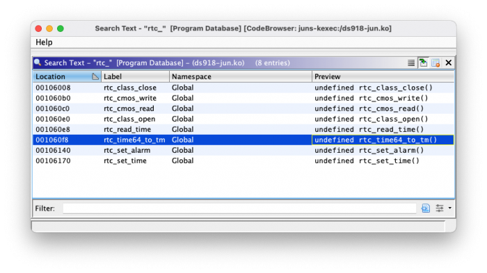
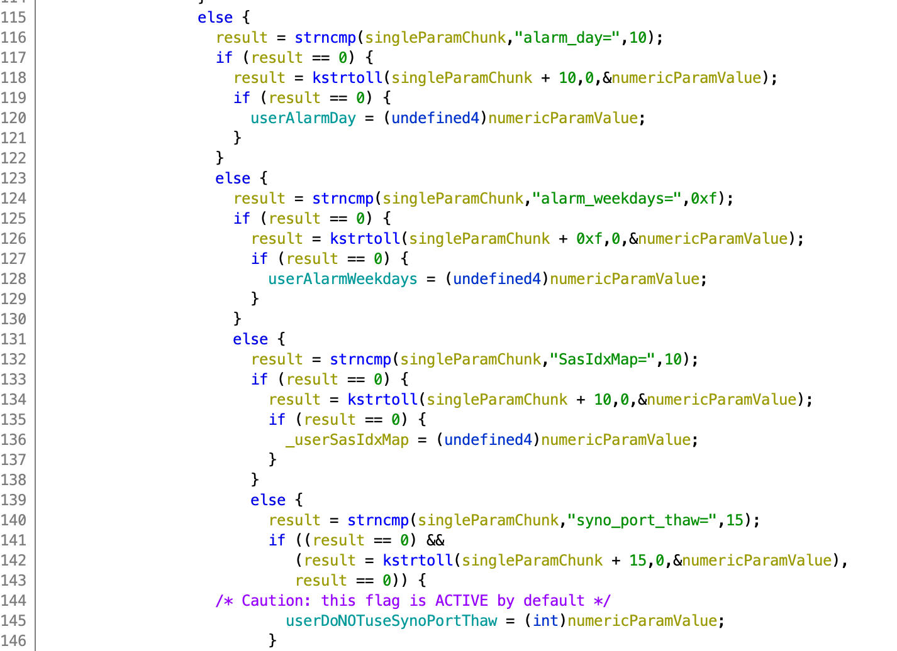

# Mysteries

Some things aren't known - this is a raw dev-brain-dump for such things. Feel free to add anything or correct anything.

### Some serial ports are needed
Source: https://xpenology.com/forum/topic/6253-dsm-61x-loader/

- Without any serial ports present in the system weird things are happening (tty dying and respawning, possibly other).
[Jun's patch](../Jun%20loader/jun.patch) contains a workaround which changes `console output` to `console none` for
multiple DSM services.

- Additionally, it looks like you need `console=ttyS0,115200n8` in the kernel line for some reason.

- He also mentioned: "Automatically apply workaround for boards without serial port."


### USB hot plug is not functional (some models)
In particular DS3617xs kernel refuses to do any USB hot plug (or even ethernet) when booted without a loader:

```
DiskStation> insmod usbcore.ko ; insmod usb-storage.ko ; insmod etxhci-hcd.ko ; 
insmod xhci-hcd.ko ; insmod uhci-hcd.ko ; insmod usbhid.ko
[ 4143.899687] ACPI: bus type USB registered
[ 4143.900791] usbcore: registered new interface driver usbfs
[ 4143.902366] usbcore: registered new interface driver hub
[ 4143.904496] usbcore: registered new interface driver ethub
[ 4143.906427] usbcore: registered new device driver usb
[ 4143.908860] usbcore: registered new interface driver usb-storage
[ 4143.916707] uhci_hcd: USB Universal Host Controller Interface driver
[ 4143.918145] uhci_hcd 0000:00:1a.0: setting latency timer to 64
[ 4143.918872] uhci_hcd 0000:00:1a.0: UHCI Host Controller
[ 4143.919599] uhci_hcd 0000:00:1a.0: new USB bus registered, assigned bus number 1
[ 4143.920617] uhci_hcd 0000:00:1a.0: irq 16, io base 0x00005040
[ 4143.921955] hub 1-0:1.0: USB hub found
[ 4143.922550] hub 1-0:1.0: 2 ports detected
// repeated for all hubs
[ 4143.984063] usbcore: registered new interface driver usbhid
[ 4143.985472] usbhid: USB HID core driver
DiskStation> insmod e1000e.ko
[ 4222.346786] e1000e: Intel(R) PRO/1000 Network Driver - 3.3.4-NAPI
[ 4222.347994] e1000e: Copyright(c) 1999 - 2016 Intel Corporation.
DiskStation> 
```

In comparison, in a normal case when a flash drive is inserted or usbcore is laoded when one is already present kernel 
should print something akin to:

```
[633053.697985] usb 1-1.2: new high-speed USB device number 5 using ehci-pci
[633053.811957] usb 1-1.2: New USB device found, idVendor=13fe, idProduct=6300, bcdDevice= 1.10
[633053.811960] usb 1-1.2: New USB device strings: Mfr=1, Product=2, SerialNumber=3
[633053.811962] usb 1-1.2: Product: Patriot Memory
[633053.811964] usb 1-1.2: Manufacturer:
[633053.811966] usb 1-1.2: SerialNumber: 070B843D9FFE8493
[633053.816924] usb-storage 1-1.2:1.0: USB Mass Storage device detected
[633053.817006] scsi host4: usb-storage 1-1.2:1.0
[633053.817069] usbcore: registered new interface driver usb-storage
[633053.817750] usbcore: registered new interface driver uas
[633054.846996] scsi 4:0:0:0: Direct-Access              Patriot Memory   PMAP PQ: 0 ANSI: 6
[633054.847300] sd 4:0:0:0: Attached scsi generic sg4 type 0
[633054.847906] sd 4:0:0:0: [sde] 30326784 512-byte logical blocks: (15.5 GB/14.5 GiB)
[633054.848571] sd 4:0:0:0: [sde] Write Protect is off
[633054.848572] sd 4:0:0:0: [sde] Mode Sense: 45 00 00 00
[633054.849172] sd 4:0:0:0: [sde] Write cache: disabled, read cache: enabled, doesn't support DPO or FUA
[633054.923381]  sde: sde1
[633054.926215] sd 4:0:0:0: [sde] Attached SCSI removable disk
```

Currently the reason is unknown. To debug it on a VM (here: Proxmox) create a dummy image and use:
```
losetup -P /dev/loop2 /home/ttg/dsm-research/ds-dsm/dummy-usb-image.bin
drive_add 1 id=dummyusb,file=/dev/loop2,if=none,format=raw,cache=none,aio=native,detect-zeroes=on,readonly=on
device_add usb-storage,id=dummyusb,drive=dummyusb,bootindex=2,removable=on
```


### RTC must be emulated?
Jun's loader contains a bunch of functions for RTC emulation. Additionally, as IG-88 from Xpenology Community mentioned
that for DS918+ RTC emulation was needed.

Some of the loader code bits realted to that:  
  
  


### S/N Validation
There seems to be a code in the GPL kernel which does some sort of S/N and MACs validation. See `mtdpart.c`.
